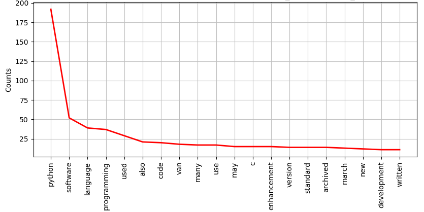

## pageparse.py
A small script that scrapes a webpage and displays a graph of the most used words  
  
  
  
### dependencies:
* BeautifulSoup
* urllib
* nltk
* enchant
* re
* aspell-en

### optional dependencies:
* aspell-fr
* aspell-de
* aspell-es
* aspell-it
* aspell-ru
* aspell-pt
